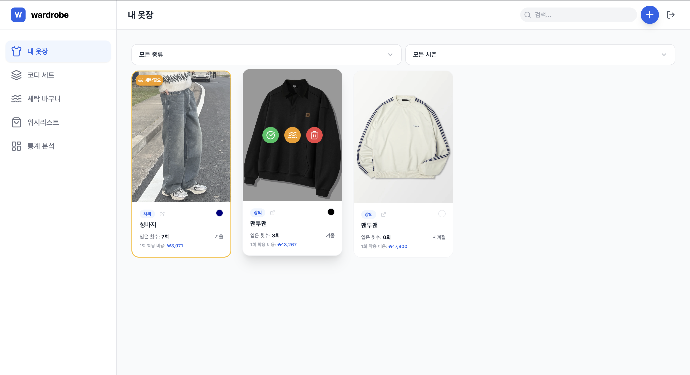
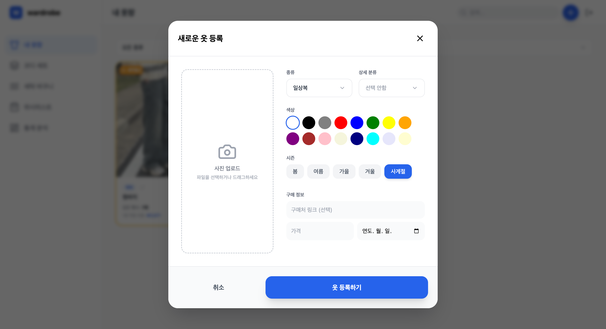
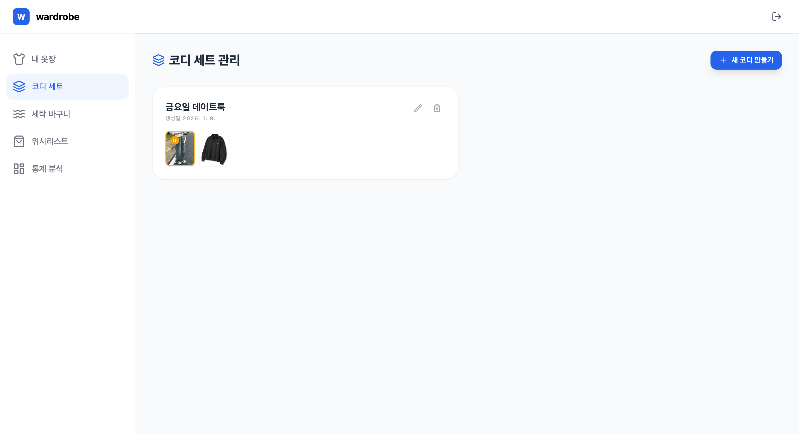
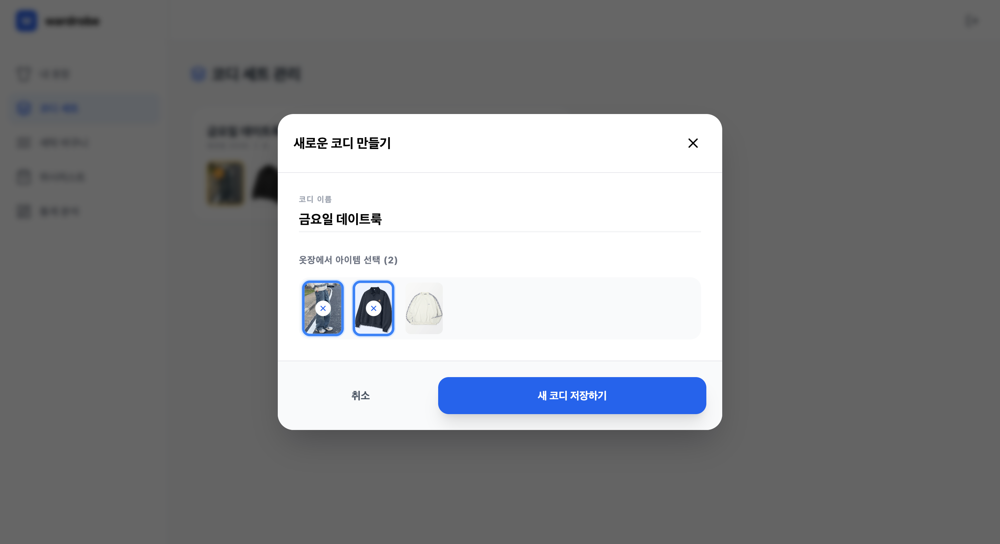
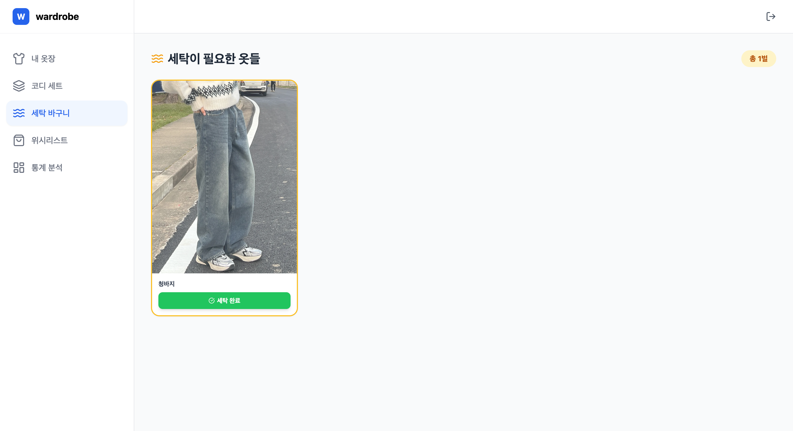
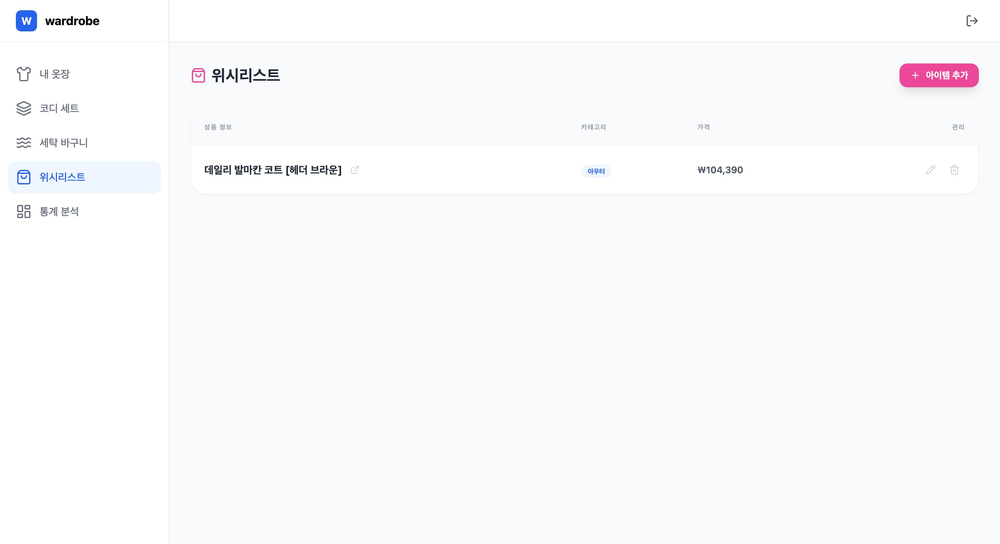
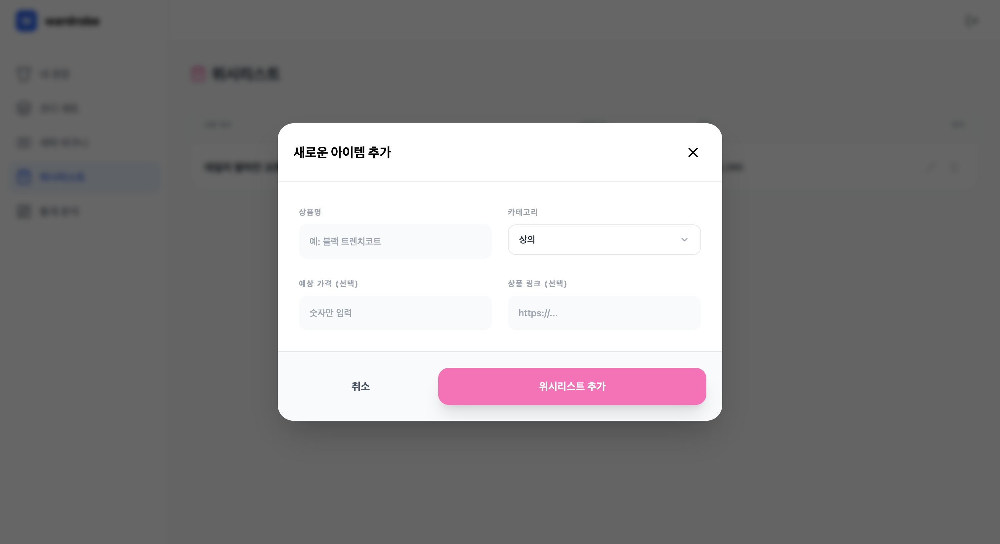
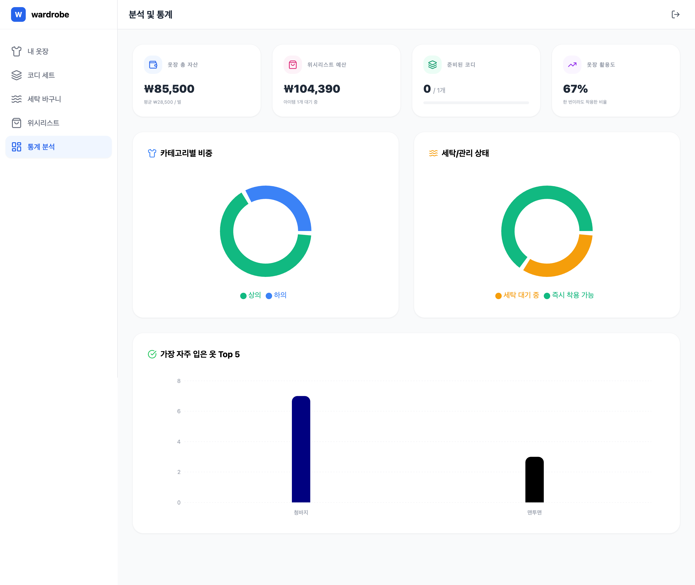

# Wardrobe

당신의 옷장을 스마트하게 관리하세요.
<br/>
옷을 등록하고, 코디를 만들고, 세탁을 추적하는 모든 것이 한 곳에.

🌐 **지금 바로 사용해보세요**: [Wardrobe](https://wardrobe-kappa-two.vercel.app)

## ✨ 소개

Wardrobe는 당신의 옷장을 디지털로 옮기는 서비스입니다. 더 이상 "오늘 뭐 입지?" 고민하지 마세요.

옷을 사진으로 등록하고, 마음에 드는 코디를 저장하고, 세탁이 필요한 옷을 한눈에 확인하세요. 언제 어떤 옷을 입었는지, 어떤 옷을 가장 많이 입는지도 알아볼 수 있어요.

간단하고 직관적인 인터페이스로 누구나 쉽게 사용할 수 있습니다.

## 🎨 주요 기능

### 내 옷장

사진을 찍어서 옷을 등록하고, 카테고리와 계절로 분류하세요. 색상으로 검색도 가능해요. 어떤 옷을 얼마나 입었는지, 언제 마지막으로 입었는지도 자동으로 기록됩니다. 구매 정보도 함께 저장하면 나중에 참고하기 좋아요.

### 코디 관리

"이 옷이랑 저 옷이랑 잘 어울리는데..." 그런 생각 했던 적 있죠? 이제 그 조합을 저장해두세요. 언제든지 저장한 코디를 불러와서 바로 입을 수 있어요.

### 세탁 추적

세탁이 필요한 옷을 따로 모아볼 수 있어요. 한눈에 보니까 빨래할 때도 편하죠. 세탁 완료하면 체크만 하면 돼요.

### 위시리스트

"나중에 사야지" 하는 옷들을 모아두세요. 가격과 링크도 함께 저장하면 나중에 찾기 쉬워요.

### 대시보드

당신의 옷장을 한눈에 볼 수 있어요. 어떤 카테고리의 옷이 많은지, 어떤 옷을 가장 많이 입는지, 계절별로 옷 분포는 어떤지 차트로 확인할 수 있습니다.

## 🛠 기술 스택

- **Framework**: React 18
- **Build Tool**: Vite 5
- **Language**: TypeScript
- **Authentication**: Supabase Auth
- **Database**: Supabase (PostgreSQL)
- **Storage**: Supabase Storage
- **Styling**: Tailwind CSS 3
- **Icons**: Lucide React
- **Charts**: Recharts
- **Notifications**: Sonner
- **Package Manager**: pnpm

## 📁 프로젝트 구조

```
Wardrobe/
├── src/
│   ├── components/          # React 컴포넌트
│   │   ├── AddItemModal.tsx      # 옷 추가/수정 모달
│   │   ├── Auth.tsx              # 인증 컴포넌트
│   │   ├── ClosetGrid.tsx        # 옷장 그리드 뷰
│   │   ├── ConfirmDialog.tsx     # 확인 다이얼로그
│   │   ├── CustomSelect.tsx      # 커스텀 셀렉트 컴포넌트
│   │   ├── Dashboard.tsx         # 대시보드 페이지
│   │   ├── LaundryTracker.tsx   # 세탁 추적 컴포넌트
│   │   ├── OutfitManager.tsx     # 코디 관리 컴포넌트
│   │   ├── Sidebar.tsx           # 사이드바 네비게이션
│   │   └── WishlistManager.tsx   # 위시리스트 관리 컴포넌트
│   ├── lib/                 # 라이브러리 설정
│   │   └── supabase.ts     # Supabase 클라이언트
│   ├── services/           # 서비스 레이어
│   │   └── closetService.ts # 옷장 아이템 CRUD 서비스
│   ├── types/              # TypeScript 타입 정의
│   │   ├── supabase.ts     # Supabase 타입
│   │   └── types.ts        # 애플리케이션 타입
│   ├── constants.ts        # 상수 정의
│   ├── App.tsx             # 메인 앱 컴포넌트
│   ├── main.jsx            # 앱 진입점
│   └── index.css           # 전역 스타일
├── supabase-schema.sql     # 데이터베이스 스키마
├── tailwind.config.js      # Tailwind CSS 설정
├── vite.config.js          # Vite 설정
└── package.json            # 프로젝트 의존성
```

## 🎨 주요 페이지

### 1. 로그인 페이지


### 2. 회원가입 페이지


### 3. 옷장 관리 (Closet)

옷을 등록하고 관리하는 핵심 기능입니다.

**주요 기능:**

- 옷 추가/수정/삭제
- 사진 업로드 (Supabase Storage)
- 카테고리별 분류 (상의, 하의, 아우터, 원피스, 일상복, 정장, 투피스, 신발/잡화)
- 서브 카테고리 분류
- 계절별 필터링 (봄, 여름, 가을, 겨울, 사계절)
- 색상별 검색
- 입은 횟수 및 마지막 착용일 추적
- 구매 정보 관리 (가격, 구매일, 구매 링크)





### 4. 코디 관리 (Outfits)

여러 옷을 조합하여 코디를 만들고 관리합니다.

**주요 기능:**

- 코디 생성 및 저장
- 코디에 포함된 아이템 조회
- 코디 수정 및 삭제
- 코디 목록 관리





### 5. 세탁 추적 (Laundry)

옷의 세탁 상태를 추적하고 관리합니다.

**주요 기능:**

- 세탁 필요 여부 표시
- 세탁 상태 토글
- 세탁이 필요한 아이템 필터링



### 6. 위시리스트 (Wishlist)

구매하고 싶은 아이템을 관리합니다.

**주요 기능:**

- 위시리스트 아이템 추가/수정/삭제
- 카테고리별 분류
- 가격 및 링크 정보 저장
- 메모 기능





### 7. 대시보드 (Dashboard)

옷장 통계 및 분석을 제공합니다.

**주요 기능:**

- 카테고리별 아이템 통계
- 계절별 아이템 분포
- 가장 많이 입은 아이템
- 최근 착용 아이템
- 총 아이템 수 및 코디 수



## 🚀 시작하기

### 필수 요구사항

- Node.js 18 이상
- pnpm
- Supabase 계정

### 설치 및 실행

```bash
# 의존성 설치
pnpm install

# 환경 변수 설정
# .env 파일을 생성하고 Supabase 설정 정보를 추가하세요 (아래 환경 변수 설정 참고)

# 개발 서버 실행
pnpm dev

# 프로덕션 빌드
pnpm build

# 빌드 미리보기
pnpm preview
```

프론트엔드 서버는 기본적으로 `http://localhost:5173`에서 실행됩니다.

## ⚙️ 환경 변수 설정

프로젝트 루트에 `.env` 파일을 생성하고 다음 환경 변수를 설정하세요:

```env
VITE_SUPABASE_URL=your_supabase_project_url
VITE_SUPABASE_ANON_KEY=your_supabase_anon_key
```

## 🔧 Supabase 설정

### 1. Supabase 프로젝트 생성

1. [Supabase](https://supabase.com)에서 새 프로젝트를 생성합니다.
2. 프로젝트 설정 > API에서 다음 정보를 확인합니다:
   - Project URL
   - anon/public key

### 2. 데이터베이스 스키마 생성

`supabase-schema.sql` 파일의 내용을 Supabase 대시보드의 SQL Editor에서 실행하여 테이블을 생성합니다.

이 스크립트는 다음 테이블을 생성합니다:

- `closet_items`: 옷장 아이템 테이블
- `outfits`: 코디 테이블
- `wishlist_items`: 위시리스트 아이템 테이블

또한 Row Level Security (RLS) 정책을 설정하여 사용자별 데이터 보안을 보장합니다.

### 3. Storage 버킷 생성

1. Supabase 대시보드에서 Storage로 이동
2. "Create bucket" 클릭
3. 버킷 이름: `closet-images`
4. Public bucket: 활성화
5. 생성

Storage 정책은 `supabase-schema.sql`에 포함되어 있으며, 사용자는 자신의 이미지만 업로드/조회/삭제할 수 있습니다.

## 🔨 개발 가이드

### 컴포넌트 구조

- `components/` 디렉토리에 모든 React 컴포넌트가 위치합니다
- 각 컴포넌트는 TypeScript로 작성되어 있습니다
- Tailwind CSS를 사용한 스타일링

### 상태 관리

- React Hooks (useState, useEffect)를 사용한 로컬 상태 관리
- Supabase를 통한 서버 상태 관리

### 데이터베이스

- Supabase PostgreSQL 데이터베이스 사용
- Row Level Security (RLS)를 통한 데이터 보안
- 사용자별 데이터 격리

### 스타일링

- Tailwind CSS 3를 사용합니다
- 반응형 디자인을 지원합니다
- 모바일 및 데스크톱 환경 모두 지원

### 타입 정의

- `src/types.ts`: 애플리케이션 레벨 타입 정의
- `src/types/supabase.ts`: Supabase에서 자동 생성된 타입

### 서비스 레이어

- `src/services/closetService.ts`: 옷장 아이템 CRUD 작업을 처리하는 서비스
- Supabase 클라이언트를 사용하여 데이터베이스와 상호작용

## 📝 주요 기능 상세

### 인증

- Supabase Auth를 사용한 이메일/비밀번호 인증
- 세션 기반 인증
- 자동 로그인 상태 유지

### 이미지 업로드

- Supabase Storage를 사용한 이미지 저장
- 사용자별 폴더 구조 (`user_id/filename`)
- Public 버킷을 통한 이미지 접근

### 데이터 필터링

- 카테고리별 필터링
- 계절별 필터링
- 색상 및 서브 카테고리 검색

### 통계 및 분석

- Recharts를 사용한 데이터 시각화
- 카테고리별 분포 차트
- 입은 횟수 통계
- 최근 활동 추적
